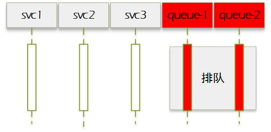
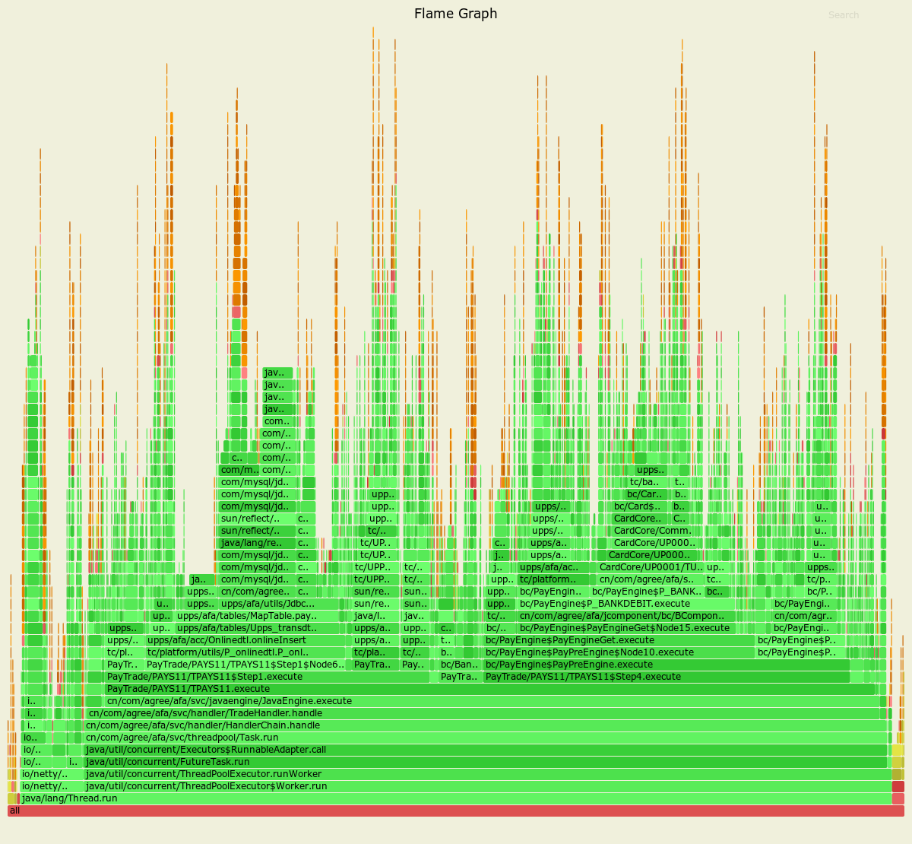

# 概述
读完本文，你会知道：

1. 如何衡量性能，要看哪些指标，这些指标之间的关系是怎么样的。
2. 面对一个性能不足的系统，如何按照一个普遍适用的策略，按部就班地排查问题并优化。
3. 为什么火焰图可以快速定位问题，如何解读火焰图。

# 性能指标
如果我们要做性能优化，首先要明白如何衡量性能。

性能主要看三大指标：并发数、响应时间和TPS

## 并发数
即系统同时并发处理的请求数量。由两个因素决定：

1. 客户端并发请求数量，对应LoadRunner里面的用户数；
2. 系统处理器数量，对应系统处理线程/进程池数量；

当[1]<[2]，系统处于空闲状态，此时并发数为[1]，差异部分为系统处理器空闲数量


当[1]>[2]，系统处于过载状态，此时并发数为[2]，差异部分为客户端请求排队数量


当[1]=[2]（或稍微大于[why?]），系统处于全速状态，此时既不会产生大量的客户端请求排队，也不会出现系统处理资源空闲的情况，因此吞吐量会达到（某种条件下的）最优状态。

## 响应时间
客户端发出请求到接收到响应，两者的时间差即为响应时间。例如12:01:01秒发出请求，12:01:05秒接收到响应，则该笔交易响应时间为4秒。

响应时间按照所处阶段可以划分为三大部分：

1. 通讯链路，包括客户端与业务系统之间请求链路、应答链路的耗时。
2. 业务系统内部，包括队列堆积，计算判断，数据库，文件IO等各种操作导致的耗时。
3. 上游系统，即业务系统依赖的上游系统的处理时间。


## TPS
每秒处理事务数，如果系统平均一秒可以处理100笔交易，则TPS为100。

TPS是衡量系统吞吐量最直观，也是最重要的指标。可以简单分析得出，TPS与并发数成正比，与**平均**响应时间成反比，即

> TPS = 并发数 / 平均响应时间

例如一个系统并发数为100，平均响应时间0.1秒，则其TPS=(100/0.1)=1000，也就是一秒钟可以处理1000笔交易。

响应时间不同产生的TPS差异对比：


并发数不同产生的TPS差异对比：


# 优化策略
那么，面对一个性能不足的系统，我们该如何下手？

还记得前面的公式吗？

> TPS = 并发数 / 平均响应时间

从这个公式可以推导出，为了提高系统吞吐量，可以从两方面着手：

1. 提高并发数
2. 降低平均响应时间

## 提高并发数
提高并发数一个很简单的方法就是`增加处理器数量`，让客户端请求不需要排队就可以马上被并发处理。但是单台机器CPU处理能力是有上限的，并不能无限制地增加处理线程/进程。

当CPU占用率达到了70%（`为什么不是100%？`），我们就不能再简单粗暴地增加处理器数量。此时应该想办法`降低CPU占用率`。

降低CPU占用率，本质就是减少每个请求对应的CPU计算量：

1. 减少计算次数。例如超大`List`转换为`HashMap`，使查询时间复杂度由`O(n)`变成`O(1)`
2. 缓存计算结果。例如`String.replaceAll(xxx, yyy)`改为类初始化的时候，预编译正则表达式`Pattern.compile(xxx)`，后面多个请求则直接复用这个对象，调用`replaceAll(yyy)`

## 降低平均响应时间
通常，通过各种手段优化程序，降低了CPU占用率后，平均响应时间也会相应缩短。但是很多时候你会发现，CPU不高的前提下，增加客户端并发请求数和系统处理器数，TPS并没有相应的增加，甚至出现下降的场景。此时，你要考虑问题是不是出在某个CPU以外的瓶颈点：

1. 内存不足导致频繁PAGE IN/OUT（交换区）
2. JAVA堆上限过小导致频繁FULL GC（STW）
3. 数据库行热点导致请求排队堵塞
4. 日志输出过多导致IO等待
5. 反复创建线程或数据库连接，没有利用池技术复用资源
6. 代码使用了全局锁导致所有线程都在锁等待

以上各种问题，每一点都可以独立成章，一大堆各式各样的工具分析排查。那么，有没有一种通用的（`不管什么原因导致的瓶颈`），语言无关的（`不管java/python/c/lua`）工具，能帮我们快速定位问题？

没错，火焰图就可以做到这些。

# 火焰图解读

## 传统分析方法
想想，我们过去通常是如何分析性能问题的？

1. 随机打开一笔交易日志，人肉查看分析各个节点的耗时。
2. 使用jstack等工具抓取线程堆栈，人肉查看分析里面是否存在锁，或者某个栈是否出现多次。
3. 使用五花八门的工具查看分析各个怀疑的点，拿着不同的锤子这里敲敲，那里打打。

那么，以上的方法存在什么问题呢？

1. 侵入式分析。需要确保关键节点有对应的日志，如果没有还得修改代码加上日志输出，而日志输出过多又反过来影响性能。如果是JDK内部代码，我们怎么改？
2. 无法处理数据抖动。例如同样一条sql在这笔请求耗时100ms，那笔请求耗时150ms，如何衡量？人肉再抽样看多几个日志？
3. 干扰信息过多。例如日志里面一大堆变量输出，或者堆栈里面一大堆非工作线程信息。
4. 无法量化数据。看到的是一条条孤立的、不直观的数据，无法从整体来总览俯瞰各个节点的数据。无法准确判定这个方法消耗了10%的CPU，那个sql占用了20%的耗时。
5. 过于依赖开发人员的经验、以及其对系统架构、代码细节的熟悉程度，换个人就完全无从下手。
6. 无法排查到应用层以外的问题，例如发起方压力不够导致系统不够繁忙，或者平台设计有问题导致交易在平台层耗时过长。

而火焰图则可以完美解决上面的这些问题。

## 原理
火焰图一般为svg格式，使用浏览器可以直接打开。

它的生成一般可以分成三个步骤：`采样、统计、生成`。部分工具可以一次性生成，但是基本原理还是一样的。

### 采样
所谓`采样`，就是通过各种工具，不断地抓取正在运行的进程的堆栈信息。

我们自己可以写个简单的shell脚本，采集java进程的堆栈信息：

```
$PID=12345
for i in {1..100}
do
    jstack $PID >> time.raw
    sleep 0.01
done
```

最终采集到的数据：

```
"main" #1 prio=5 os_prio=0 tid=0x00007f2a0000f800 nid=0xaee waiting on condition [0x00007f2a09544000]
   java.lang.Thread.State: WAITING (parking)
        at sun.misc.Unsafe.park(Native Method)
        at java.util.concurrent.locks.LockSupport.park(LockSupport.java:175)
        at java.util.concurrent.locks.AbstractQueuedSynchronizer.parkAndCheckInterrupt(AbstractQueuedSynchronizer.java:836)

"main" #1 prio=5 os_prio=0 tid=0x00007f2a0000f800 nid=0xaee waiting on condition [0x00007f2a09544000]
   java.lang.Thread.State: WAITING (parking)
        at sun.misc.Unsafe.park(Native Method)
        at java.util.concurrent.locks.LockSupport.park(LockSupport.java:175)
        at java.util.concurrent.locks.AbstractQueuedSynchronizer.parkAndCheckInterrupt(AbstractQueuedSynchronizer.java:836)

...
```

### 统计
`统计`就是读取采样数据，然后按出现次数进行归集：

> cat time.raw | ./stackcollapse-jstack.pl > time.coll

归集后数据变成这样的形式（调用栈+采样次数）：


```
sun.misc.Unsafe.park;java.util.concurrent.locks.LockSupport.park;java.util.concurrent.locks.AbstractQueuedSynchronizer.parkAndCheckInterrupt 10
xxx1;yyy1;zzz1 20
xxx2;yyy2 30
...
```

### 生成
最后一步就是根据统计信息生成火焰图：

> cat time.coll | ./flamegraph.pl --colors=java > time.svg

## 图形解读

火焰图-CPU：



火焰图-耗时：


最终展现出来的图形很像一个个在抖动的火焰，因而得名`火焰图`。

火焰图主要有两种，分别对应两个维度的数据：`CPU、耗时`。

那么，我们该怎么看火焰图？

1. x轴表示某个方法片段的比例，越宽则说明占比越高，优化后对应的效果也越好。
2. y轴表示程序堆栈，从下往上表示完整的代码调用链，我们可以根据y轴快速准确定位代码位置。
3. 颜色只是为了区分层次，无特定含义。
4. 点击某个区块，会以该区块为基础，自动将其上层调用链展开，下层则自动置灰。当我们需要集中精力分析某个代码片段的时候会经常用到。
5. 移到某个区块，最底下会自动显示对应的`函数名、采样次数、整体百分比`。
6. 按`Ctrl+F`，在弹出的文本框输入关键字，会自动高亮包含该关键字的区块，并在右下角显示相关区块占用的`相对百分比`。

以上面的`火焰图-CPU`为例，我们分析下里面的信息：

1. 最底层为all区块（100%），次底层左侧和右侧的小区块是java的native、gc、vm栈（2%），中间一大块则是用户层（98%）。
2. 中间可以分为两部分：`netty`（7%），`ThreadPoolExecutor`（90%）。
3. 一直往上到`PayTrade/PAYS11/TPAYS11.execute`（86%）则是应用层（业务层）代码，通常也是我们的优化重点。
4. 点击`PayTrade/PAYS11/TPAYS11.execute`自动展开，然后按`Ctrl+F`，在弹出的文本框输入`mysql`，相关的区块自动高亮，同时右下角显示`Matched: 29%`，即mysql相关调用的`相对百分比`为`29%`。如果此时系统平均CPU占用为`70%`，则其`绝对百分比`为`70% * 86% * 29% = 17%`，如果我们把这部分代码干掉，可以节省17%的物理CPU资源。

`火焰图-耗时`也完全可以用上面的思路分析，只是此时的维度由`CPU`变成了`耗时`。


# 下一步
本文简单介绍了`性能指标`、`优化策略`以及`火焰图解读`，后面会另文补充各种语言下生成火焰图、定位问题以及解决的介绍。

各种语言对应的火焰图工具：

| 语言 | 名称 |
| - | --- |
| 通用 | [FlameGraph](https://github.com/brendangregg/FlameGraph)|
| java | [async-profiler](https://github.com/jvm-profiling-tools/async-profiler) [perf-map-agent](https://github.com/jvm-profiling-tools/perf-map-agent)|
| python | [pyflame](https://github.com/uber/pyflame) [py-spy](https://github.com/benfred/py-spy)|

