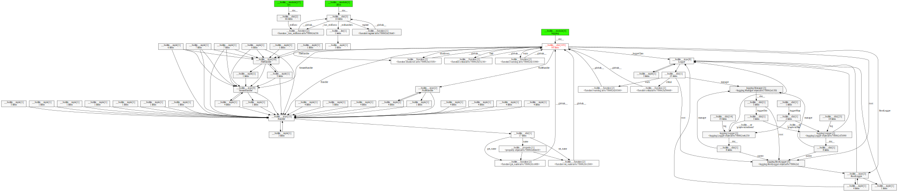

# 概述

一次投产后，监控告警，虚拟机物理内存使用率一直在上升。通过 nmon 数据分析，发现业务进程占用的内存比投产前有明显的增加。

# 热更新机制

开始之前，先介绍下运行平台的架构。平台使用` c 语言`编写，通过 `python`解释器执行业务代码。为了支持热更新，平台会在出口卸载 py 模块，这样下次请求进来就会重新加载 py 模块，代码变更就可以及时生效。

简化版本的平台代码(plat.py)

```python
#!/usr/bin/env python
# -*- coding: utf-8 -*-

import sys

def callOne():
    # 备份
    origList = set(sys.modules)
    try:
        # 调用业务代码
        import busi
        busi.run()
    finally:
        # 还原
        for modName in list(sys.modules.keys()):
            # 卸载业务代码载入的模块
            if modName not in origList:
                del sys.modules[modName]


def main():
    callOne()
    raw_input("press <ENTER> to exit")


if __name__ == "__main__":
    main()

```

业务代码(busi.py)没有复杂逻辑，简单的一个 import+print

```python
#!/usr/bin/env python
# -*- coding: utf-8 -*-

from logging.handlers import RotatingFileHandler

def run():
    print("wow, i am ok")

```

# 问题重现

检查进程内存：

```sh
cat /proc/$(ps aux | grep plat | grep -v grep | awk '{print $2}')/status | grep VmRSS
```

只占用了 7M 内存：

```sh
VmRSS:      7608 kB
```

试试改成调用 1000 次：

```python
def main():
    for i in range(1000):
        callOne()
    raw_input("press <ENTER> to exit")
```

可以观察到此时内存占用飙升到了 558M：

```sh
VmRSS:    558148 kB
```

# 比较 LOW 的排查办法

当时线上发现问题之后，用的是最**LOW**的排查方法：`把版本差异代码逐段注释`，最终定位到问题所在：

```python
# from logging.handlers import RotatingFileHandler

def run():
    print("wow, i am ok")

```

那么为什么简单的一行 import 会导致内存泄漏呢？通过分析 `logging.__init__.py`，发现问题所在

```python
import atexit
atexit.register(shutdown)
```

 logging 模块被 import 过程中会调用`atexit.register(shutdown)` ，后者会将这个函数保存在`atexit._exithandlers`

平台热更新机制导致logging模块循环**构造->注册->GC 无法回收**，引起物理内存占用飙升。

通过增加清理代码可以发现内存泄漏问题得到解决，再次验证这个结论：

```python
from logging.handlers import RotatingFileHandler

def run():
    print("wow, i am ok")

    # 清理
    import atexit
    atexit._exithandlers = []
```

# 比较不 LOW 的排查办法

## 分析大对象

python 内置了 API 获取内存对象信息：

```python
# 获取所有GC对象
gc.get_objects()

# 获取对象大小（不包含间接引用）
sys.getsizeof(obj)
```

我们先根据对象大小排序，看看是否有大对象：

```python
def showMemoryBySize():
    objList = []
    for obj in gc.get_objects():
        size = sys.getsizeof(obj)
        objList.append([obj, size])
    topList = sorted(objList, key=lambda e: e[1], reverse=True)[:10]
    for (obj, size) in topList:
        print("OBJ: %s, TYPE: %s, SIZE=%sM, REPR=%s" % (
            id(obj),
            type(obj),
            size / 1024 / 1024,
            repr(obj)[:50],
        ))
    print("object count: %s" % len(objList))
```

由于笔记本性能太拉胯，循环 1000 次要跑很久，这里改成了循环 100 次。可以看到没有明显的大对象：

```
OBJ: 119037464, TYPE: <type 'dict'>, SIZE=0M, REPR={'SocketType': <class 'socket._socketobject'>, 'ge
OBJ: 117955848, TYPE: <type 'dict'>, SIZE=0M, REPR={'SocketType': <type '_socket.socket'>, 'getaddrin
OBJ: 117039448, TYPE: <type 'dict'>, SIZE=0M, REPR={'SocketType': <class 'socket._socketobject'>, 'ge
OBJ: 117087224, TYPE: <type 'dict'>, SIZE=0M, REPR={'SocketType': <type '_socket.socket'>, 'getaddrin
OBJ: 117040536, TYPE: <type 'dict'>, SIZE=0M, REPR={'__path__': ['C:\\Python27\\lib\\logging'], 'LogR
OBJ: 117929912, TYPE: <type 'dict'>, SIZE=0M, REPR={'SocketType': <class 'socket._socketobject'>, 'ge
OBJ: 114833608, TYPE: <type 'dict'>, SIZE=0M, REPR={'SocketType': <type '_socket.socket'>, 'getaddrin
OBJ: 117931272, TYPE: <type 'dict'>, SIZE=0M, REPR={'__path__': ['C:\\Python27\\lib\\logging'], 'LogR
OBJ: 42392296, TYPE: <type 'dict'>, SIZE=0M, REPR={'functools': <module 'functools' from 'C:\Python2
OBJ: 42426712, TYPE: <type 'dict'>, SIZE=0M, REPR={'bytearray': <type 'bytearray'>, 'IndexError': <t
object count: 78383
```

输出末尾可以看到有 7.8W 个对象未被回收，考虑是不是有大量小对象，我们按类型合并排序：

```python
def showMemoryByType():
    objDict = defaultdict(lambda: [0, 0])
    for obj in gc.get_objects():
        size = sys.getsizeof(obj)
        objType = type(obj)
        objSum = objDict[objType]
        objSum[0] += 1 # 个数
        objSum[1] += size # 大小
    topList = sorted(objDict.items(), key=lambda e: e[1][1], reverse=True)[:10]
    for (objType, (count, size)) in topList:
        print("TYPE: %-30s, COUNT=%5s, SIZE=%sM" % (
            objType,
            count,
            size / 1024 / 1024,
        ))
```

大头在`dict/function/type`：

```
TYPE: <type 'dict'>                 , COUNT= 6444, SIZE=10M
TYPE: <type 'function'>             , COUNT=31701, SIZE=3M
TYPE: <type 'type'>                 , COUNT= 4041, SIZE=3M
TYPE: <type 'tuple'>                , COUNT= 7836, SIZE=0M
TYPE: <type 'list'>                 , COUNT= 2927, SIZE=0M
TYPE: <type 'weakref'>              , COUNT= 4385, SIZE=0M
TYPE: <type 'getset_descriptor'>    , COUNT= 2018, SIZE=0M
TYPE: <type 'member_descriptor'>    , COUNT= 1987, SIZE=0M
TYPE: <type 'functools.partial'>    , COUNT= 1400, SIZE=0M
TYPE: <type 'instancemethod'>       , COUNT= 1501, SIZE=0M
```

我们按类型分别统计：

```python
def showMemoryByType2():
    def _showTop(_type, _d):
        print("TYPE: %s" % _type)
        # 按大小排序
        _topList = sorted(_d.items(), key=lambda e: e[1][1], reverse=True)[:10]
        for (_key, (_count, _size)) in _topList:
            print("KEY: %-20s, COUNT=%s, SIZE=%sK" % (
                _key,
                _count,
                _size / 1024,
            ))

    dictInfo = {}
    funcInfo = {}
    typeInfo = {}
    for obj in gc.get_objects():
        size = sys.getsizeof(obj)
        objType = type(obj)
        if objType is dict:
            # dict：按长度合并
            d = dictInfo
            key = str(len(obj))
        elif objType is FunctionType:
            # function：按名字合并
            d = funcInfo
            key = "%s.%s" % (obj.__module__, obj.__name__)
        elif objType is type:
            d = typeInfo
            # type：按名字合并
            key = "%s.%s" % (obj.__module__, obj.__name__)
        else:
            continue
        l = d.setdefault(key, [0, 0])
        l[0] += 1  # 个数
        l[1] += size  # 大小
    _showTop("dict", dictInfo)
    _showTop("func", funcInfo)
    _showTop("type", typeInfo)
```

输出如下：

```
TYPE: dict
KEY: 144                 , COUNT=102, SIZE=1251K
KEY: 88                  , COUNT=100, SIZE=1226K
KEY: 185                 , COUNT=100, SIZE=1226K
KEY: 95                  , COUNT=101, SIZE=638K
KEY: 7                   , COUNT=711, SIZE=571K
KEY: 31                  , COUNT=203, SIZE=512K
KEY: 27                  , COUNT=201, SIZE=506K
KEY: 6                   , COUNT=511, SIZE=481K
KEY: 19                  , COUNT=208, SIZE=362K
KEY: 5                   , COUNT=1334, SIZE=354K

TYPE: func
KEY: logging.__init__    , COUNT=1300, SIZE=142K
KEY: logging.handlers.__init__, COUNT=1200, SIZE=131K
KEY: threading.__init__  , COUNT=1000, SIZE=109K
KEY: logging.handlers.emit, COUNT=800, SIZE=87K
KEY: logging.handlers.close, COUNT=500, SIZE=54K
KEY: logging.emit        , COUNT=400, SIZE=43K
KEY: logging.critical    , COUNT=300, SIZE=32K
KEY: logging.info        , COUNT=300, SIZE=32K
KEY: logging.exception   , COUNT=300, SIZE=32K
KEY: threading.__repr__  , COUNT=300, SIZE=32K

TYPE: type
KEY: socket._fileobject  , COUNT=100, SIZE=126K
KEY: socket._socketobject, COUNT=100, SIZE=114K
KEY: weakref.KeyedRef    , COUNT=100, SIZE=91K
KEY: logging.LogRecord   , COUNT=100, SIZE=87K
KEY: logging.handlers.SMTPHandler, COUNT=100, SIZE=87K
KEY: logging.handlers.BaseRotatingHandler, COUNT=100, SIZE=87K
KEY: logging.handlers.HTTPHandler, COUNT=100, SIZE=87K
KEY: threading._Timer    , COUNT=100, SIZE=87K
KEY: logging.Formatter   , COUNT=100, SIZE=87K
KEY: logging.LoggerAdapter, COUNT=100, SIZE=87K
```

`func/type`大部分都跟`logging`有关，那么`dict`里面的又是什么呢？

```python
dictList = []
if key == "144" and len(dictList) < 10:
    dictList.append(obj)
```

下断点查看`dictList`，发现都是`ModuleType`，我们分析下都有哪些模块：

```python
def showMemoryByModule():
    modInfo = {}
    for obj in gc.get_objects():
        size = sys.getsizeof(obj)
        objType = type(obj)
        if objType is dict:
            modName = obj.get("__name__", "")
            if not modName:
                modName = obj.get("__module__", "")
            l = modInfo.setdefault(modName, [0, 0])
            l[0] += 1  # 个数
            l[1] += size  # 大小
    # 按大小排序
    _topList = sorted(modInfo.items(), key=lambda e: e[1][1], reverse=True)[:10]
    for (_key, (_count, _size)) in _topList:
        print("KEY: %-20s, COUNT=%s, SIZE=%sK" % (
            _key,
            _count,
            _size / 1024,
        ))
```

不出所料，`logging`赫然在列：

```
KEY: logging             , COUNT=1500, SIZE=2423K
KEY:                     , COUNT=1186, SIZE=1451K
KEY: logging.handlers    , COUNT=1300, SIZE=1207K
KEY: xmlrpclib           , COUNT=18, SIZE=25K
KEY: __builtin__         , COUNT=2, SIZE=24K
KEY: _socket             , COUNT=2, SIZE=24K
```

## 查找引用关系

到了这里，我们已经知道logging存在泄露，那么具体是哪行代码导致的呢？

python 内置了 API 获取内存对象

```python
# 获取入参对象引用的其他对象
gc.get_referents(obj)

# 获取引用入参对象的其他对象
gc.get_referrers(obj)
```

因为对象引用关系是一张图，手撸代码来排查会比较繁琐，我们可以直接使用现成的库`objgraph`，只需要传入对象，就会直接生成一张可视化的引用关系图

```shell
pip install objgraph
```

需要额外安装`graphviz`和`xdot`，官网指引是使用pip安装，我试过之后报错。这里直接使用apt安装

```shell
sudo apt install graphviz xdot
```

要调用的核心方法

```python
def show_backrefs(objs, # 对象列表
                  max_depth=3, # 最大深度
                  extra_ignore=(), # 忽略id集
                  filter=None, # 过滤器
                  too_many=10, # 最大广度
                  highlight=None, # 高亮
                  filename=None, # 输出文件名
                  extra_info=None, # 额外信息
                  refcounts=False, # 引用计数
                  shortnames=True, # 简短名称
                  output=None, # 输出对象
                  extra_node_attrs=None, # 额外属性
                 ):
```

默认情况下，生成的引用关系图会很庞大，我们需要编写一个过滤器，把无关对象过滤

```python
def _filter(target):
    name = getattr(target, "__module__", "")
    if not name:
        name = getattr(target, "__name__", "")
    # 跳过graphviz
    if name.startswith("graphviz"):
        return False
    # 跳过logging.handlers
    if name.startswith("logging.handlers"):
        return False
    # 跳过未被外部引用的函数
    if name.startswith("logging") and sys.getrefcount(target) <= 6:
        return False
    return True
```

logging模块下面的function非常多，但是绝大部分都是function与module之间的互相引用，所以引用计数为1的function不是我们关注点，需要排除。但是我们不能直接判断`sys.getrefcount(target) <= 1`，因为对象遍历过程`objgraph`和我们自己的`filter`也会引用这个对象。通过调试，只要把1改成6即可。

```python
def showRefRel():
    # 搜索logging对象
    objs = []
    for obj in gc.get_objects():
        if type(obj) is dict:
            modName = obj.get("__name__", "")
            if modName == "logging":
                objs.append(obj)
    
    # 输出引用关系图
    objgraph.show_backrefs(objs, # 对象列表
                    max_depth=100, # 最大深度
                    filter=_filter, # 过滤器
                    too_many=100, # 最大广度
                    filename="ref.svg", # 输出文件名
                    refcounts=True, # 引用计数
                    shortnames=False, # 简短名称
                    extra_node_attrs=None, # 额外属性
                    )
```

使用浏览器打开生成的`ref.svg`，可以直观看到问题的引用关系链路

````
atexit._exithandlers
logging.shutdown
logging.shutdown.__globals__
logging.__dict__
````





# 总结

1. 不完善的模块热更新机制很容易引发内存泄露问题，对应的业务代码躺枪（内心无辜独白：我就是老老实实地按照规范写着代码，为什么也会中枪呢？）。
2. 未来容器化之后，每次都是全量版本，就用不到这个热更新机制了。
3. 临时解决，只要在业务代码执行前`import`好对应的模块，后续不要反复加载/卸载。
4. 这个模块热更新机制其实还引发了另外一个问题，后文继续讨论。
