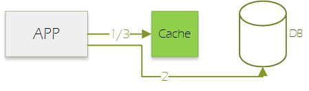

https://juejin.im/entry/5a40abb16fb9a0451e400886
https://www.zhoujunwen.com/2018/aop-aspectj-springaop

# 前言
读完本文，你会知道：

1. 缓存的基本概念
2. 如何使用spring的缓存
3. 如何改进spring的缓存

# 概述
传统模式下，很多并发不大的系统都是直接将查询请求发到DB：

随着业务发展，业务逻辑会变得越来越复杂，系统并发数也会逐渐上涨，导致传递到DB的查询请求以几何级数上涨，DB慢慢变得不堪重负。

为了应对这个问题，我们需要将常用的数据缓存起来，避免`业务量*N`的查询请求穿透到DB。

## 方案1-外部定时刷新

1. 缓存刷新程序读取DB，然后写入缓存；
2. 联机交易直接读取缓存，不再访问数据库；

这个方案存在几个缺点：

1. 需要特定缓存程序定期刷新。如果这个刷新动作出现问题，会产生大面积的参数变更不生效。
2. 缓存数据格式死板。为了通用，格式必须跟DB表保持一致，应用层获取到之后还需要自行加工处理。
3. 刷新频率无法精细控制。比如一些数据一天刷新一次即可，一些数据需要10秒刷新一次。
4. 无法区分冷热数据，空间利用率差。比如一张表10000条数据，常被访问的也就100条，另外9900条数据可能一年都不会用到一次，还是一样被加载到缓存里面。

## 方案2-访问自动刷新

1. 联机交易访问缓存，如果有值且未过期，直接返回调用者；
2. 访问数据库获取最新值；
3. 写入缓存，返回调用者；

这个方案解决了`方案1`的各种问题，但是

# 准备工作

# 原始缓存方案

# spring缓存方案
# 改进
# 发散
