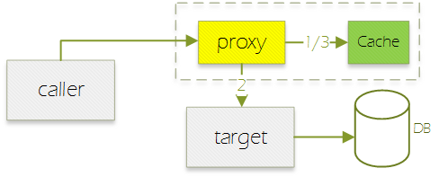

读完本文，你会知道：

1. 缓存的基本概念
2. spring缓存抽象模型
3. 如何使用spring缓存
4. 如何扩展spring缓存


目录
@[toc]

# 概述
传统模式下，很多并发不大的系统都是直接将查询请求发到DB：


随着业务发展，业务逻辑会变得越来越复杂，系统并发数也会逐渐上涨，导致传递到DB的查询请求以几何级数上涨，DB慢慢变得不堪重负。

为了应对这个问题，我们需要将常用的数据缓存起来，避免`业务量*N`的查询请求穿透到DB。

根据刷新方式的不同，大体有两种方案。

## 方案1-外部定时刷新


1. 缓存刷新程序读取DB，然后写入缓存；
2. 联机交易直接读取缓存，不再访问数据库；

这个方案存在几个缺点：

1. 需要特定缓存程序定期刷新。如果这个刷新动作出现问题，会产生大面积的参数变更不生效。
2. 缓存数据格式死板。为了通用，格式必须跟DB表保持一致，应用层获取到之后还需要自行加工处理。
3. 刷新频率无法精细控制。比如一些数据一天刷新一次即可，一些数据需要10秒刷新一次。
4. 无法区分冷热数据，空间利用率差。比如一张表10000条数据，常被访问的也就100条，另外9900条数据可能一年都不会用到一次，还是一样被加载到缓存里面，冷数据不能根据LRU淘汰。

## 方案2-访问自动刷新


1. 联机交易访问缓存，如果有值且未过期，直接返回调用者；
2. 访问数据库获取最新值；
3. 写入缓存，返回调用者；

因为`方案1`的种种问题，所以现在主流都是采样`方案2`。

# demo准备

接下来我们做个demo，看看应该如何逐步实现并改进缓存方案。

需求：通过用户id查询用户name

## UserService-用户服务接口
接口只有一个方法`getNameFromId`，入参为用户id，返回值为用户名：

```java
public interface UserService {
    public String getNameFromId(String userId);
}
```

## AbstractUserService-用户服务抽象类
提供一个方法模拟实现从DB查询，让子类可以直接调用：

```java
public abstract class AbstractUserService implements UserService {
    private Logger log = LoggerFactory.getLogger(getClass());
    
    protected String getNameFromDb(String userId) {
        log.info("db query: {}", userId);
        // 暂停
        try {
            Thread.sleep(100);
        } catch (InterruptedException e) {
            throw new RuntimeException(e);
        }
        // 返回
        return "Name_" + userId;
    }
}
```

## testDirect - 测试方法
通过传入不同的实现来测试对应的缓存效果：

```java
    private void testDirect(UserService userSvc, String userId) {
        String name;
        // 1
        name = userSvc.getNameFromId(userId);
        log.info("result: {} -> {}", userId, name);
        // 2
        name = userSvc.getNameFromId(userId);
        log.info("result: {} -> {}", userId, name);
        // 3
        name = userSvc.getNameFromId(userId);
        log.info("result: {} -> {}", userId, name);
    }
```


# 无缓存
无缓存版本直接调用父类方法访问DB：

```java
@Component
public class NoCacheUserService extends AbstractUserService {
    @Override
    public String getNameFromId(String userId) {
        return getNameFromDb(userId);
    }
}
```

执行后从输出可以观察到每次调用都是访问DB：

```
db query: I0001            
result: I0001 -> Name_I0001
db query: I0001            
result: I0001 -> Name_I0001
db query: I0001            
result: I0001 -> Name_I0001
```

# 原始缓存
程序员的第一想法肯定是不用搞那么多杂七杂八的，自己动手用Map实现一个缓存：

```java
@Component
public class SimpleCacheUserService extends AbstractUserService {
    private Map<String, String> cacheMap = new ConcurrentHashMap<>();
    
    public String getNameFromId(String userId) {
        String name = cacheMap.get(userId);
        if (name == null) {
            name = getNameFromDb(userId);
            cacheMap.put(userId, name);
        }
        return name;
    }
}
```

执行后从输出可以观察到只有第一次调用访问DB，后面都是直接从缓存获取

```
db query: I0001            
result: I0001 -> Name_I0001
result: I0001 -> Name_I0001
result: I0001 -> Name_I0001
```

那么，这个方案存在什么不足呢？

1. 侵入性高。业务代码与缓存逻辑耦合在一起，不利于后续维护。
2. 不能灵活扩展，比如某类热点用户id才缓存，其他不缓存。
3. 绑死ConcurrentHashMap，无法随意切换其他更优秀的缓存实现，比如ehcache/redis等。
4. 缺乏自动刷新、过期淘汰等现代缓存特征。

那么，spring是怎么做的呢？

# spring缓存
相比之前侵入式的方案，spring采用的是声明式缓存，缓存逻辑完全脱离业务代码。我们要做的只是在方法上面增加一个注解`@Cacheable`

```java
@Component
public class SpringCacheUserService extends AbstractUserService {
    @Override
    @Cacheable("SpringCache")
    public String getNameFromId(String userId) {
        return getNameFromDb(userId);
    }
}
```

运行后好像没效果，那是因为我们还没开启缓存。在程序入口添加一个注解`@EnableCaching`：

```java
@SpringBootApplication
@EnableCaching
public class TestCacheApp {
}
```

再次运行就可以观察到缓存生效了

如果要实现K开头的用户id才缓存，怎么做呢？很简单，修改下注解，使用`SPEL`声明条件即可：

```java
@Cacheable(cacheNames="SpringCache", condition="#userId.startsWith('K')")
```

我们简单分析下原理。

原始调用链：


spring通过AOP，在调用者和目标类中间插入代理类，拦截方法调用，实现缓存逻辑：



在这个设计下，应用层统一使用`@Cacheable`，而后端的缓存实现就可以灵活扩展，还能`自由切换、组合`各种优秀的缓存方案，比如ehcache/guava/caffeine/redis。

# 逐步扩展
## 支持过期时间
spring默认使用`ConcurrentHashMap`实现缓存，因此是不支持过期时间的，我们将其换成`Caffeine`。

添加依赖：

````groovy
    implementation 'org.springframework.boot:spring-boot-starter-cache'
    implementation 'com.github.ben-manes.caffeine:caffeine:2.7.0'
```

在application.yml添加配置，设置缓存2秒过期：

```yml
spring.cache.caffeine.spec: expireAfterWrite=2s
```

添加测试方法，中间插入一个sleep休眠2.2秒：

```java
    private void testExpire(UserService userSvc, String userId) {
        String name;
        // 1
        name = userSvc.getNameFromId(userId);
        log.info("result: {} -> {}", userId, name);
        // 2
        name = userSvc.getNameFromId(userId);
        log.info("result: {} -> {}", userId, name);
        // sleep
        try {
            Thread.sleep(2200);
        } catch (InterruptedException e) {
            throw new RuntimeException(e);
        }
        // 3
        name = userSvc.getNameFromId(userId);
        log.info("result: {} -> {}", userId, name);
        // 4
        name = userSvc.getNameFromId(userId);
        log.info("result: {} -> {}", userId, name);
    }
```

执行结果可以观察到sleep之后，缓存过期失效，重新查询DB：

```
db query: I0001            
result: I0001 -> Name_I0001
result: I0001 -> Name_I0001
db query: I0001            
result: I0001 -> Name_I0001
result: I0001 -> Name_I0001
```

这个方案下缓存过期时间是全局性的，不支持不同类型的缓存单独配置不同的缓存过期时间。比如普通参数表可以1小时后过期，但是关键参数表却必须控制在1分钟内过期，如何实现呢？

## 精细控制过期时间
我们可以从注解着手，在缓存名称后面追加过期时间，变成：

```java
@Cacheable(cacheNames="SpringCache,2")
```

新增一个`CacheManager`，重写父类方法`createCaffeineCache`，在里面处理缓存名称：

```java
@Component
public class ExtCacheManager extends CaffeineCacheManager {
    @Override
    protected Cache createCaffeineCache(String name) {
        // 解析缓存名称
        String[] items = name.split(",");
        String cacheName = items[0];
        long cacheTime = 60;
        if (items.length >= 2) {
            cacheTime = Long.parseLong(items[1]);
        }
        // 创建缓存
        com.github.benmanes.caffeine.cache.Cache<Object, Object> nativeCache = 
                Caffeine.newBuilder()
                .expireAfterWrite(cacheTime, TimeUnit.SECONDS)
                .build();
        return new CaffeineCache(cacheName, nativeCache);
    }
}
```

执行后从输出可以观察到此时缓存过期时间可以精细控制了。

## 过期处理策略
到了这里，我们需要暂时停下来，讨论下缓存过期的处理策略。

当缓存过期后，如果不加以处理，直接在当前请求更新缓存，就会导致多个并发请求瞬间穿透到DB：


一种做法是判断到过期的时候加锁，抢占成功的就去DB刷新缓存，其他请求则等待：


从上图可以看到，这样会造成请求瞬间卡顿。

我们改进下，未争抢到锁的请求不等待，而是直接使用旧值：


乍看之下没问题，但是仔细想想，如果一直没请求进来，在缓存过期很久之后再出现这个场景，此时取到的旧值已经严重过期，再直接使用可能会引发问题：


先总结下前面的需求，我们要`尽可能做到`：

1. 不并行更新缓存，否则会冲击到DB；
2. 不产生锁等待，否则会导致瞬间卡顿；
3. 不使用过期缓存值，否则会影响到业务处理；

这几点按重要性排序应该是`3 > 1 > 2`，综合几个策略，我们可以：

1. 缓存`即将`过期，1个请求负责刷新缓存，其他请求则`使用缓存值`；
2. 缓存`已经`过期，1个请求负责刷新缓存，其他请求则`锁等待`；


此时的缓存有效时间会不断的向前滚动，只需要1个请求负责更新缓存，其他请求直接使用缓存值：


## 实现提前刷新

当caffeine判断到需要刷新的时候（预设的`刷新时间`或`过期时间`到达），就会主动调用我们实现的CacheLoader：

```java
public interface CacheLoader<K, V> {
    V load (K key) throws Exception;
}
```

但是这个接口方法只有一个`key`参数，我们怎么实现刷新呢？


从前面的这个图可以看到，缓存模块并不知道值来源于DB还是哪里，刷新的唯一途径就是调用目标方法。但是目标方法上面只有一个`@Cacheable`注解而已，我们怎么获取到相关信息呢？

spring给我们提供的方案是注解上面的`keyGenerator`参数，每次缓存操作的时候，spring都会调用这个接口获取到key：

```java
@FunctionalInterface
public interface KeyGenerator {
	Object generate(Object target, Method method, Object... params);
}
```

我们可以在这上面做文章，使用自定义key，将目标方法保存起来，然后提供一个invoke方法给CacheLoader调用。另外，我们还需要实现`equals/hashCode/toString`等key比较时要用到的基础方法。

```java
public class ExtKey {
    private final Object target;
    private final Method method;
    private final Object[] params;
    private final int hashCode;
    
    public ExtKey(Object target, Method method, Object... params) {
        this.target = target;
        this.method = method;
        // 复制参数
        this.params = new Object[params.length];
        System.arraycopy(params, 0, this.params, 0, params.length);
        // 计算hash
        this.hashCode = Arrays.deepHashCode(this.params);
    }
    
    public Object invoke() throws Exception {
        return this.method.invoke(target, params);
    }

    @Override
    public boolean equals(Object other) {
        return (this == other ||
                (other instanceof ExtKey && Arrays.deepEquals(this.params, ((ExtKey) other).params)));
    }

    @Override
    public final int hashCode() {
        return this.hashCode;
    }

    @Override
    public String toString() {
        return getClass().getSimpleName() + " [" + StringUtils.arrayToCommaDelimitedString(this.params) + "]";
    }
}
```

KeyGenerator直接返回ExtKey即可：

```java
@Component("ExtKeyGenerator")
public class ExtKeyGenerator implements KeyGenerator {
    @Override
    public Object generate(Object target, Method method, Object... params) {
        return new ExtKey(target, method, params);
    }
}
```

在注解里面添加刷新时间（-0.5即提前0.5秒刷新）及KeyGenerator信息：

```java
    @Cacheable(cacheNames="SpringCache,1,-0.5", 
        keyGenerator="ExtKeyGenerator")
```

然后在缓存初始化里面添加CacheLoader：

```java
@Component
public class ExtCacheManager extends CaffeineCacheManager {
    //
    private Logger log = LoggerFactory.getLogger(TestCacheApp.class);
    
    @Override
    protected Cache createCaffeineCache(String name) {
        // 解析缓存名称
        String[] items = name.split(",");
        String cacheName = items[0];
        long cacheTime = 60;
        long refreshTime = 0;
        // 缓存过期时间
        if (items.length >= 2) {
            cacheTime = (long) (1000 * Float.parseFloat(items[1]));
        }
        // 缓存刷新时间 = 缓存过期时间 + 时间差（负数）
        if (items.length >= 3) {
            refreshTime = cacheTime + (long) (1000 * Float.parseFloat(items[2]));
        }
        // 缓存加载器
        CacheLoader<Object, Object> loader = new CacheLoader<Object, Object>() {
            @Override
            public @Nullable Object load(@NonNull Object key) throws Exception {
                log.info("refresh cache: {}", key);
                ExtKey extKey = (ExtKey) key;
                return extKey.invoke();
            }
        };
        // 创建缓存
        Caffeine<Object, Object> builder = Caffeine.newBuilder()
                .expireAfterWrite(cacheTime, TimeUnit.MILLISECONDS);
        if (refreshTime > 0) {
            // 提前刷新
            builder.refreshAfterWrite(refreshTime, TimeUnit.MILLISECONDS)
                   .executor(Runnable::run);
        }
        return new CaffeineCache(cacheName, builder.build(loader));
    }
}
```

对于一些系统，如果加载方法不能运行在公共线程池`ForkJoinPool.commonPool()`，而必须在缓存请求线程执行，则需要显式指定 `executor(Runnable::run)`。

接下来测试下效果，首先新建线程类：

```java
    private static class VirtualUser extends Thread {
        // 入参
        private final UserService userSvc;
        private final String userId;
        private final CountDownLatch latch;
        
        // 停止标志
        public volatile boolean stopFlag = false;
        // 计数
        public int counter = 0;
        
        public VirtualUser(UserService userSvc, String userId, CountDownLatch latch) {
            this.userSvc = userSvc;
            this.userId = userId;
            this.latch = latch;
        }
        
        @Override
        public void run() {
            try {
                // 等待
                latch.await();
                // 循环执行
                while (true) {
                    // 测试
                    String name = userSvc.getNameFromId(userId);
                    // 累加
                    counter++;
                    // 暂停
                    Thread.sleep(0);
                    // 是否停止
                    if (stopFlag) {
                        break;
                    }
                }
            }
            catch (InterruptedException e) {
                throw new RuntimeException(e);
            }
        }
    }
```

然后新建一个多线程测试方法：

```java
    private void testMultiThread(UserService userSvc, String userId) throws Exception {
        // 虚拟用户数
        final int VUSER_COUNT = 200;

        log.info("create thread ...");
        CountDownLatch latch = new CountDownLatch(1);
        List<VirtualUser> threadList = new ArrayList<>();
        for (int i = 0; i < VUSER_COUNT; i++) {
            VirtualUser thread = new VirtualUser(userSvc, userId, latch);
            thread.start();
            threadList.add(thread);
        }
        
        log.info("go ...");
        latch.countDown();

        Thread.sleep(10 * 1000);

        log.info("stop thread ...");
        for (VirtualUser thread : threadList) {
            thread.stopFlag = true;
        }
        
        int totalCount = 0;
        for (VirtualUser thread : threadList) {
            thread.join();
            totalCount += thread.counter;
        }
        
        log.info("all done, counter: {}", totalCount);
    }
```

通过比较参数`cacheNames="SpringCache,1,-0.5"`和`cacheNames="SpringCache,1"`对应的执行效果，可以观察到`提前刷新`是比`过期刷新`效率高的，并且随着`并发数`和`刷新耗时`的上升，两者的差距会越来越明显。

## 集中配置

缓存名称、大小、过期时间、刷新时间等参数目前都是直接放在注解上面，不利于管理维护，我们可以将其集中起来。

在application.yml添加配置，key为类名，value为`容量,过期时间,刷新时间`：

```yml
ext.cache:
  cacheItemMap:
    SpringCacheUserService:   100,1,-0.5
```

配置对应的bean：

```java
@Component
@ConfigurationProperties("ext.cache")
public class CacheConfig {
    private Map<String, String> cacheItemMap;

    public void setCacheItemMap(Map<String, String> cacheItemMap) {
        this.cacheItemMap = cacheItemMap;
    }
    
    public CacheItem getCacheItem(String cacheName) {
        // 配置值
        String cfgStr = cacheItemMap.get(cacheName);
        String[] items = cfgStr.split(",");
        long maxSize = Long.parseLong(items[0]);
        long cacheTime = 1000 * (long) Float.parseFloat(items[1]);
        long refreshTime = 1000 * (long) Float.parseFloat(items[2]);
        // 计算刷新时间：-1 + 5 = 4
        if (refreshTime != 0) {
            refreshTime += cacheTime;
        }
        // 返回
        return new CacheItem(maxSize, cacheTime, refreshTime);
    }
}
```

```java
public class CacheItem {
    private final long maxSize;
    private final long cacheTime;
    private final long refreshTime;
    
    public CacheItem(long maxSize, long cacheTime, long refreshTime) {
        this.maxSize = maxSize;
        this.cacheTime = cacheTime;
        this.refreshTime = refreshTime;
    }
    
    public long getMaxSize() {
        return maxSize;
    }
    
    public long getCacheTime() {
        return cacheTime;
    }
    
    public long getRefreshTime() {
        return refreshTime;
    }
}
```

修改下`CacheManager`读取配置：

```java
@Component
public class ExtCacheManager extends CaffeineCacheManager {
    //
    private Logger log = LoggerFactory.getLogger(TestCacheApp.class);

    @Autowired
    private CacheConfig cacheConfig;
    
    @Override
    protected Cache createCaffeineCache(String name) {
        // 获取配置
        CacheItem cacheItem = cacheConfig.getCacheItem(name);
        long maxSize = cacheItem.getMaxSize();
        long cacheTime = cacheItem.getCacheTime();
        long refreshTime = cacheItem.getRefreshTime();
        // 缓存加载器
        CacheLoader<Object, Object> loader = new CacheLoader<Object, Object>() {
            @Override
            public @Nullable Object load(@NonNull Object key) throws Exception {
                log.info("refresh cache: {}", key);
                ExtKey extKey = (ExtKey) key;
                return extKey.invoke();
            }
        };
        // 创建缓存
        Caffeine<Object, Object> builder = Caffeine.newBuilder()
                .expireAfterWrite(cacheTime, TimeUnit.MILLISECONDS);
        if (maxSize > 0) {
            builder.maximumSize(maxSize);
        }
        if (refreshTime > 0) {
            // 提前刷新
            builder.refreshAfterWrite(refreshTime, TimeUnit.MILLISECONDS)
                   .executor(Runnable::run);
        }
        return new CaffeineCache(name, builder.build(loader));
    }
}
```

原来的缓存名称都是直接写在注解上面的，如果要动态生成，需要拓展`CacheResolver`：

```java
@FunctionalInterface
public interface CacheResolver {
	Collection<? extends Cache> resolveCaches(CacheOperationInvocationContext<?> context);
}
```

我们只需要实现`AbstractCacheResolver`的`getCacheNames`即可：

```java
@Component("ExtCacheResolver")
public class ExtCacheResolver extends AbstractCacheResolver {
    public ExtCacheResolver(CacheManager cacheManager) {
        super(cacheManager);
    }
    
    @Override
    protected Collection<String> getCacheNames(CacheOperationInvocationContext<?> context) {
        // 使用类名作为缓存名称
        String cacheName = context.getTarget().getClass().getSimpleName();
        return Arrays.asList(cacheName);
    }
}
```

在注解里面引用`CacheResolver`：

```java
@Cacheable(keyGenerator="ExtKeyGenerator",
        cacheResolver="ExtCacheResolver")
```

每个使用缓存的地方都要这样注解，对用户太不友好了。我们可以利用spring的注解组合功能：

```java
@Target({
    ElementType.METHOD,
})
@Retention(RetentionPolicy.RUNTIME)
@Inherited
@Documented
@Cacheable(keyGenerator="ExtKeyGenerator",
        cacheResolver="ExtCacheResolver")
public @interface ExtCacheable {

}
```

直接引用这个注解：

```java
    @ExtCacheable
    public String getNameFromId(String userId) {
        return getNameFromDb(userId);
    }
```

相比原来冗长的注解，简洁不少：
```java
@Cacheable(cacheNames="SpringCache,1,-0.5", keyGenerator="ExtKeyGenerator")
->
@ExtCacheable
```

## 模块关系

看到这里，头脑是不是有点蒙圈了？

我们整理一下各个模块之间的关系：


# 发散思考

全程下来，很深的感受是AOP不愧为spring的两大特征之一（另外一个是DI），而SCS作为协调者，做到了caller/target/cache三者之间的平滑处理。

那么，我们还可以用SCS做什么？

1. 切换本地缓存caffeine为远程缓存redis；
2. 组合caffeine和redis，少量、时效性不高的参数放在caffeine（分布式、速度快），大量、时效性高的数据放在redis（节省内存、更新方便）；

demo下载链接：[ [testcache.7z](/source-raw/_posts/springcache/testcache.7z)]
