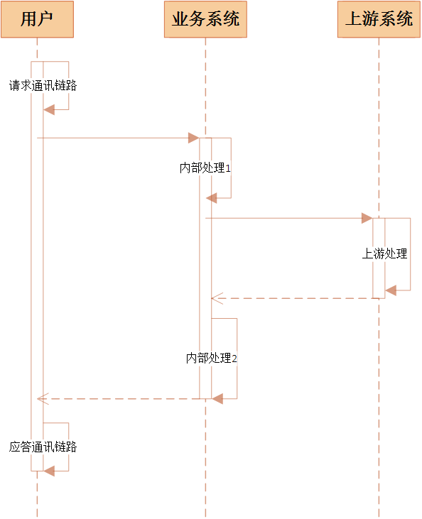

## 性能指标

### RT
Response Time，响应时间。这个时间是从用户发出请求起，接收到响应止。例如用户12:01:01秒发出请求，12：01:05秒接收到响应，则该笔交易响应时间为4秒。

响应时间按照阶段可以划分为3部分：

1. 通讯链路耗时，包括用户与业务系统之间请求链路、应答链路的耗时。
2. 业务系统内部耗时，包括读取请求报文，内部计算，数据库操作，IO、发送应答报文等。
3. 业务系统请求上游系统耗时，例如一个支付系统需要请求核心记账，此时核心作为支付系统的上游系统，核心记账消耗的时候也会记入支付系统响应时间。

### TPS
Transactions Per Second，每秒处理事务数。如果系统平均一秒可以处理100笔交易，则TPS为100。

### 并发数

## 分析方法
